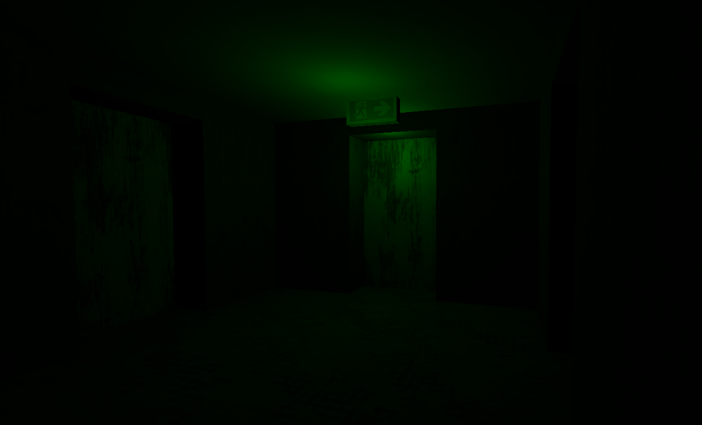

# Gan

A 3D game fitting in a small exe standalone file

## Resources

[Textures](https://ambientcg.com)
[Background](https://polyhaven.com/hdris)

- Raw: 1024 \* 1024 (1256 KB)
- Compression => 256 \* 256, JPG quality 35 (6 KB)

## Run

1. Install go
2. Install wails
3. `wails dev`

## Build

### Quick build

`wails build`

### Production

1. Install upx, add env variable to exe
2. `wails build -trimpath -upx -upxflags="--lzma"`

| Command                                                       | Size comparison |
| ------------------------------------------------------------- | --------------- |
| `wails build`                                                 | 9618 KB         |
| `wails build --trimpath`                                      | 9597 KB         |
| `wails build -trimpath -upx`                                  | 3402 KB         |
| `wails build -trimpath -upx --best`                           | 3402 KB         |
| `wails build -trimpath -upx -upxflags="--best --ultra-brute"` | 2876 KB         |
| `wails build -trimpath -upx -upxflags="--lzma"`               | 2876 KB         |
